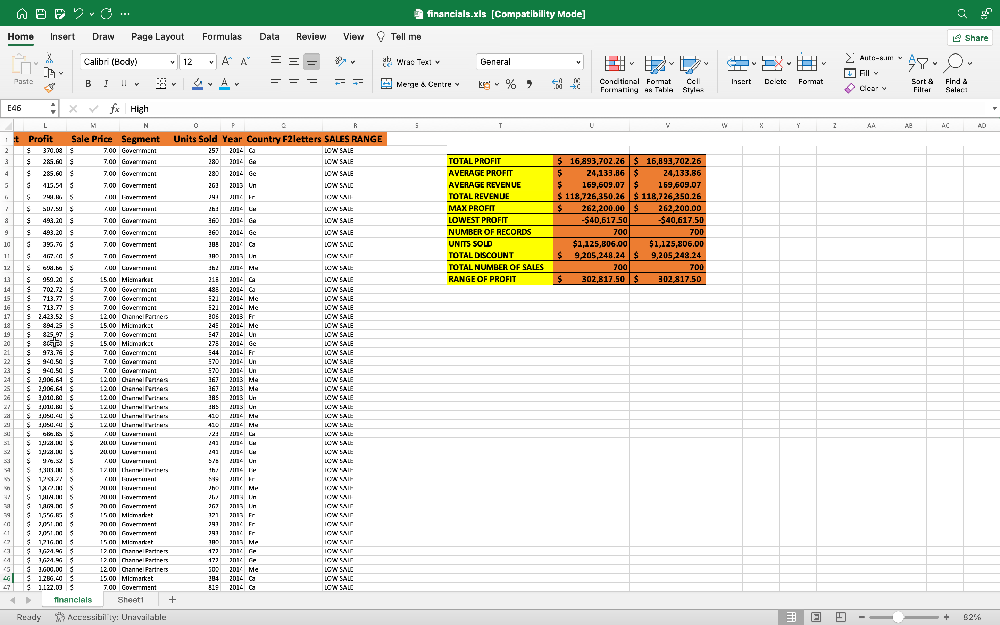

# Data-Analysis-of-sales-made-by-a-manufacturing-Company
## **Introduction**
I worked on a financial sales data of a certain company to process and provide insight from it.
The data has columns for Sales, Product, Country, Month Name, Discounts, Units Sold, Manufacturing Price, Profit, Sales Price, Segment, Year, and Cost of Goods Sold.
To prepare the data, i ensured to change all the values to their resoective categories (e.g Currency, Date, Values etc.)
I also created a column header to make it clearer.
### **TASK**

The specific task was to use the sales data to derive the following:-
-	Total Profit
-	Average Profit
-	Average Revenue
-	Total Revenue
-	Maximum Profit
-	Lowest Profit
-	Number of Records
-	Units Sold
-	Total Discount
-	Total Number of Sales
-	Range of Profit
-	To create a column named ‘sales range’ that returns a high sales if the sales value is above average and low sales if is below average value, secondly to create a column that displays only the first two letters of the countries.
 The Screenshot shown Below Illustratesthe solution from my analysis.

To derive the results as shown in the diagramabove, here are the formulas I used, based on the excel workbook:-
-  Total Profit =SUM(L2:L701)
-  Average Profit =AVERAGE(L2:L701)
-  Average Revenue =AVERAGE(A2:A701)
-  Total Revenue =SUM(A2:A701)
-  Maximum Profit =MAX(L2:L701)
-  Lowest Profit =MIN(L2:L701)
-  Number of sales recorded =COUNT(P2:P701)
-  Units Sold =SUM(O2:O701)
-  Total discount =SUM(F2:F701)
- Range of Profit =U7-U8

The diagram above shows the added column of sales range and the first two letters of the countries.
and to derive the sales range, i used the 'IF' function {=IF(A2:A701>$U$5,"HIGH SALE", "LOW SALE")}
For the first two letters of the countries i used the 'LEFT' function {=LEFT(C2,2)}

